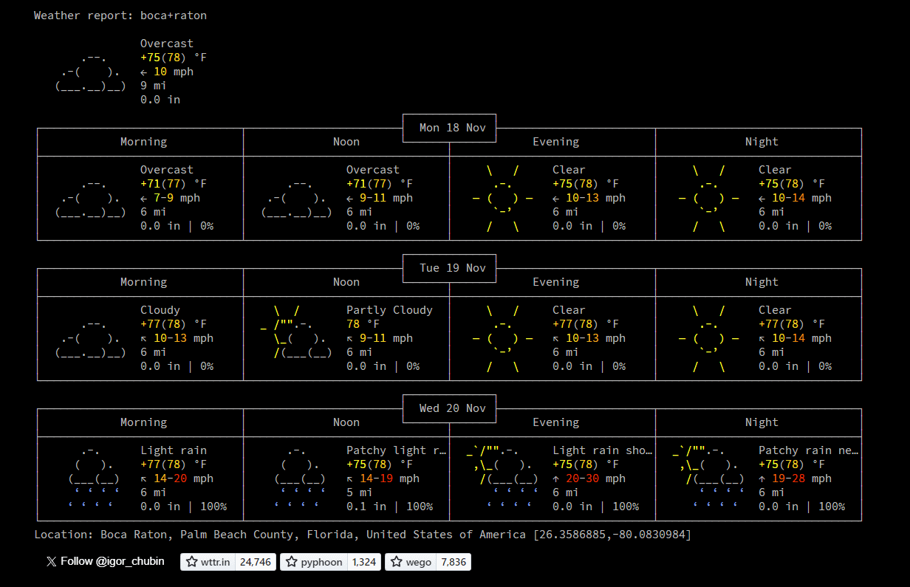

🥁 ASCII Weather!

Based on https://github.com/chubin/wttr.in

I took the above library and created a simple html file that displays a three day weather forecast. Just change the city name in the html.

✅ Load weather.html

It looks like this:

💡 There is no title and the favicon is black colored base64 code so it doesn't need to ping a server and one less file to deal with.

💬 I think its perfect to add to a nostalgia webpage or project.

🎸 Enjoy!

